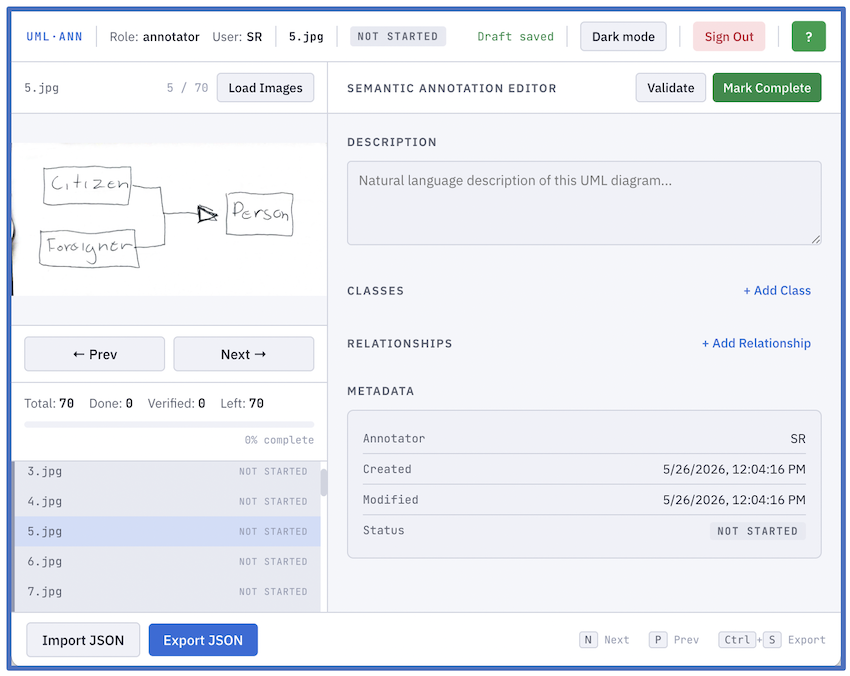

# UML Annotator

> Semantic annotation of handwritten UML class diagrams — local, fast, zero dependencies.


---

<!-- Replace with your screenshot: recommended 1400×860 px, save as images/screenshot_main.png -->


---

## What it does

Captures the **semantic structure** of handwritten UML class diagrams — classes, attributes, methods, and typed relationships — as validated JSON ground truth for machine learning and computer vision research. No bounding boxes. No OCR. Just meaning.

👉 **[Live demo](https://sargaleano.github.io/uml-annotator/)** — open in any modern browser, no install needed.

👉 Or, **run locally**. No build step required. Just clone and open:
 
```bash
git clone https://github.com/sargaleano/uml-annotator.git
cd uml-annotator
open index.html          # macOS
# or: start index.html   # Windows
# or: xdg-open index.html  # Linux
```
 
Alternatively simply download the ZIP from the green **Code** button above and open any `index.html` file directly in your browser.
 
---

## Quick Start

```
1. Open index.html in Chrome, Firefox or Edge
2. Select a role (Annotator or Verifier) and enter a username
3. Load Images → annotate → Validate → Mark Complete → Export JSON
```

Keyboard shortcuts: `N` next · `P` previous · `Ctrl+S` export


> **Sample images included.** The `images/` folder contains a set of handwritten UML class diagram images from Piucco (2021), released into the public domain (CC0). After cloning, load them directly into the tool with **Load Images** — or use any UML diagram images from your own files.
---

## Features

| | |
|---|---|
| 🎯 Semantic editor | Classes, attributes, methods, typed relationships, multiplicities |
| ✅ Two-level validation | Structural integrity + completeness, with clear error messages |
| 👥 Two-role workflow | Annotator creates · Verifier approves, with name and timestamp |
| 💾 Autosave | localStorage every 2 s, full session recovery on crash or sign-out |
| 📦 Import / Export | JSON with filename and schema mismatch detection |
| 🌗 Dark / light theme | Preference saved across sessions |

---

## Workflow

### Annotator Mode
- Load images from disk
- Fill in: description, classes (name, attributes, methods), relationships
- Click **Mark Complete** when an image is fully annotated
- Use **Validate** at any time to check for errors
- Export regularly with **Export JSON** or `Ctrl+S`


👉 **Allowed relationship types**: `association` · `inheritance` · `aggregation` · `composition` · `dependency` · `realization`


### Verifier Mode
- Import an existing `annotations.json`
- Load images
- Review each annotation
- Click **Mark Verified** to approve or **Remove Verification** to revoke
- Export the verified dataset

👉 **Allowed completion status**: 
- `not_started` — no content yet
- `in_progress` — partially annotated
- `completed` — fully annotated, ready for verification
- `verified` — reviewed and approved by a verifier

---

## Output Format

```json
{
  "image_filename.png": {
    "metadata": {
      "annotator": "alice",
      "timestamp_created": "2026-01-01T00:00:00Z",
      "timestamp_modified": "2026-01-01T01:00:00Z",
      "verified": false,
      "verifier": null,
      "timestamp_verified": null,
      "status": "completed"
    },
    "description": "Natural language description of the diagram.",
    "classes": [
      {
        "name": "ClassName",
        "attributes": ["attr1", "attr2"],
        "methods": ["method1()"]
      }
    ],
    "relationships": [
      {
        "source": "ClassName",
        "target": "OtherClass",
        "type": "association",
        "multiplicity_source": "1",
        "multiplicity_target": "0..*"
      }
    ]
  }
}
```

---

## Repo Structure

```
uml-annotator/
├── index.html        ← entry point (main UI)
├── style.css         ← dark/light themes via CSS variables
├── app.js            ← state and coordination
├── ui.js             ← rendering and events
├── storage.js        ← autosave and import/export
├── schema.js         ← validation and UML ontology
├── annotations.json  ← Sample / exported annotations
└── images/           ← sample diagram images (replace with yours)

```

---
 
## Citation
 
If you use this software in academic work, please cite:
 
```
Rojas-Galeano, S. (2026). UML Annotator: Semantic annotation of handwritten UML class diagrams (v1.0). Universidad Distrital Francisco José de Caldas.
MIT License. https://sargaleano.github.io/uml-annotator/
```
---
 
## License
 
Copyright (c) 2026 Sergio Rojas-Galeano
 
Released under the **MIT License** — free to use, modify, and distribute with attribution.
See [`LICENSE`](LICENSE) for the full text.
 
---
 
## Contact
 
**Sergio Rojas-Galeano**

Universidad Distrital Francisco José de Caldas · Bogotá, Colombia

✉ srojas@udistrital.edu.co

---

## Acknowledgements

Thanks to **Leticia Piucco** for creating and sharing the handwritten UML class diagram dataset, and to **Iván Felipe Prado-Blanco** (ifpradob@udistrital.edu.co) for providing the sample annotations file.

## References

> Piucco, L. (2021). *Handwritten UML Class diagrams* [Data set]. Kaggle.
> https://www.kaggle.com/datasets/leticiapiucco/handwritten-uml-class-diagrams
